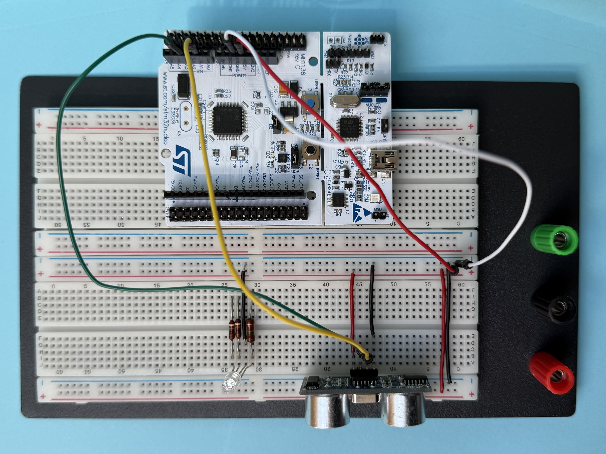
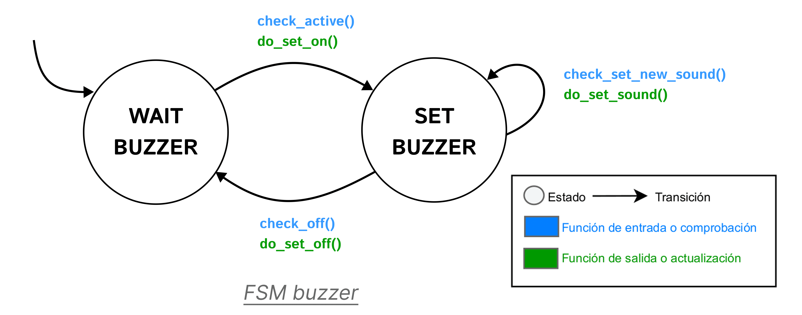

# Urbanite project

The project *Urbanite* works using an ultrasound transceiver to measure the distance to an object in a parking aid system mounted on a car. It uses a finite state machine (FSM) to control the ultrasound sensor, a display (RGB LED) to show the distance, and a button to interact with the system. We will develop this project on the Nucleo-STM32F446RE board.

> &nbsp;&nbsp;&nbsp;&nbsp;🌐🇪🇸 El proyecto *Urbanite* funciona utilizando un transceptor de ultrasonidos para medir la distancia a un objeto en un sistema de *parktronic* montado en un coche. Emplea una máquina de estados finitos (FSM) para controlar el sensor de ultrasonidos, una pantalla (LED RGB) para mostrar la distancia y un botón para interactuar con el sistema. Desarrollaremos este proyecto en la placa Nucleo-STM32F446RE.

## Version 1

In Version 1, the system operates with the user button only. The user button is connected to the pin PC13. The code uses the EXTI13 interrupt to detect when the button is pressed and released.

### Key features of the setup

| Parameter | Value     |
| --------- | --------- |
|Pin	|PC13|
|Mode	|Input|
|Pull up/ down|No push no pull|
|EXTI	|EXTI13|
|ISR	|EXTI15_10_IRQHandler|
|Priority	|1|
|Subpriority	|0|
|Debounce time	|100-200 ms|

### FSM of the button

## Version 2

In Version 2, the system incorporates the HC-SR04 ultrasonic transceiver to measure distances using three timers (TIM2, TIM3, and TIM5). The trigger pin (PB0) sends an ultrasonic pulse, and the echo pin (PA1) receives the reflected signal. 

The distance is calculated based on the time between the emission and reception of the echo, with a timer resolution of 1 microsecond, where 1 cm corresponds to 58.3 microseconds, since the speed of sound is 343 m/s at 20ºC.

### Ultrasonic transceiver HC-SR04

| Parameter | Value     |
| --------- | --------- |
|Power supply	|5 V|
|Current|	15 mA|
|Angle of aperture|	15º|
|Frequency|	40 kHz|
|Measurement range	|2 cm to 400 cm|
|Pins	|PB0 (Trigger) and PA1 (Echo)|
|Mode	|Output (Trigger) and alternative (Echo)|
|Pull up/ down	|No pull|
|Timer|	TIM3 (Trigger) and TIM2 (Echo)|
|Channel|	2|

### Timers

The system uses 3 timers: (i) one to control the duration of the trigger signal, (ii) another to measure the echo time, and (iii) another to measure the timeout between consecutive measurements that we want to make. 

#### Trigger signal

| Parameter | Value     |
| --------- | --------- |
|Timer|	TIM3|
|Prescaler|	(to be calculated in the  [_timer_trigger_setup()](stm32f4__ultrasound_8c.html#ac4c3b91c72ccc14205bff17fb07c8a58) function)|
|Period|	10 μs|
|ISR|	[TIM3_IRQHandler()](interr_8c.html#ac8e51d2183b5230cbd5481f8867adce9)|
|Priority|	4|
|Subpriority|	0|

#### Echo signal

| Parameter | Value     |
| --------- | --------- |
|Timer|	TIM2|
|Prescaler|	15|
|Period|1 μs |
|ISR|	[TIM2_IRQHandler()](interr_8c.html#a38ad4725462bdc5e86c4ead4f04b9fc2)|
|Priority|	3|
|Subpriority|	0|

#### Measurement signal

| Parameter | Value     |
| --------- | --------- |
|Timer|	TIM5|
|Prescaler|	(to be calculated in the [_timer_new_measurement_setup()](stm32f4__ultrasound_8c.html#a288d1d8f0fec4fa8ebcec4679e1c2d48) function)|
|Period|100 ms |
|ISR|	[TIM5_IRQHandler()](interr_8c.html#a5e66446caf21dd90191dc07a13ce2378)|
|Priority|	5|
|Subpriority|	0|

### FSM of the ultrasonic transceiver

### Validation video

Here below, there is a picture of the second version result of the *Urbanite* project.

**Click on the image** of the demo of the prototype of the second version to see the Urbanite demo: 

## Version 3

In Version 3, the system integrates an RGB LED display controlled via the TIM4 timer in PWM mode, with each LED assigned a separate channel. The PWM signal has a fixed period of 20 ms and a variable duty cycle, determining the intensity of each color. A 50 Hz frequency prevents visible flickering. The display represents distance by adjusting the red, green and blue intensities: closer objects appear red, farther ones blue, and intermediate distances green.

### Characteristics of the display

| Parameter | Value     |
| --------- | --------- |
|Pin LED red|	PB6|
|Pin LED green|	PB8|
|Pin LED blue|	PB9|
|Mode	|Alternative|
|Pull up/ down|	No pull|
|Timer	|TIM4|
|Channel LED red    |1|
|Channel LED green	|3|
|Channel LED blue	|4|
|PWM mode|	PWM mode 1|
|Prescaler|	(to be calculated for a frequency of 50 Hz)|
|Period|	(to be calculated for a frequency of 50 Hz)|
|Duty cycle LED red	|(variable, depends on the color to show)|
|Duty cycle LED green|	(variable, depends on the color to show)|
|Duty cycle LED blue|	(variable, depends on the color to show)|

### Duty cycle values for each color in function of the distance

These values depend on the `PORT_DISPLAY_RGB_MAX_VALUE`. 

|Distance|	Color|	LED red	| LED green|	LED blue|
| --------- | --------- |--------- |--------- |--------- |
|$[0-25]$ cm	|Red (danger)	|100%	|0%|	0%|
|$(25-50]$ cm|	Yellow (warning)|	37%|	37%|	0%|
|$(50-150]$ cm|	Green (no~problem)	|0%|	100%|	0%|
|$(150-175]$ cm|	Turquoise (info)|	10%|	35%|	32%|
|$(175-200]$ cm|	Blue (OK)|	0%|	0%|	100%|
|Other distances|	Off (inactive)|	0%|	0%|	0%|

### FSM of the display

## Version 4

In Version 4 the system completes its FSM to interact with the user button, the ultrasonic transceiver, and the display. The system will show in the gdb-server terminal the current state of the Urbanite system (if it is ON or OFF), whether the display has been paused and the distance to the object detected by the ultrasonic transceiver. The color of the display changes according to how far the object is, following the same color rules as version 3.

It is also implemented the low-consumption mode. This mode turns the system to sleep mode if there is no activity. Sleep mode consists of stopping the SysTick counter and pausing the execution of the main program until an external interruption occurs. As a consequence of the sleep mode, although the Urbanite system is taking measures, the display is turned off. Nonetheless, the display will be turned on anyway whenever an inminent crash is detected.

### FSM of the system

## Final result of the 4th version

To validate the correct operation of the Urbanite project, a final test is conducted focusing on the ultrasonic sensor. This test confirms that the sensor accurately detects distances and functions as intended within the system. A video demonstration has been recorded to showcase the successful execution of the test and to provide visual proof of the sensor’s performance.

### Ultrasound signals

Here below, the trigger and the echo signals of the ultrasound are observed through an osciloscope. The objective of this test is to check out that the duration of the echo signal and the real distance to the object are coherent.

**Click on the image** of the screen of the osciloscope to watch a video showing how the duration of the echo signal grows as the distance to the object increases: 

### Complete system

Here below, there is a picture of the final result of this version of the *Urbanite* project.

**Click on the image** of the final result of the prototype of the fourth version to see the Urbanite demo: 

## Version 5

In this definite version, four improvements are developed. These improvements are:
* Linear interpolation function to assign colors to the LED according to the distance (low level).
* Different functionalities for different press-times of the button (middle-low level).
* A new ultrasound with its independent LED to measure the distance to either rear or front obstacles (middle-high level).
* A buzzer, with its own FSM, whose frequency becomes higher while the rear or front obstacle gets closer (high level).

### Improvement 5.1 - Linear interpolation function for the LED colors

So far, the colors of the LED belonged to a discrete set of colors. In this improvement, the color of the LED will change continuously from `COLOR_OFF`, when the distance is greater than 200 cm, to `COLOR_RED`, when the distance is lower than 5 cm.

In the chart below, it is represented the new distance-color assignment function. The proportions of both colors defining the color range are calculated according to how near or far the current distance is from the minimum and maximum boundaries of its distance range.

|Distance|	Color range|
| --------- | --------- |
|$[0-5]$ cm	| Red |
|$(5-25]$ cm	| Between red and yellow |
|$(25-50]$ cm| Between yellow and green |
|$(50-150]$ cm|	Between green and turquoise |
|$(150-175]$ cm| Between turquoise and blue |
|$(175-200]$ cm| Between blue and off |
|Other distances| Off |

### Improvement 5.2 - Different functionalities for different press-times of the button

This improvement has been designed with the next one in mind. 

So far, the button let the user turn on or off the Urbanite system and its low-consumption mode. In this implementation, the button additionally enables the user to change the measurement of the distances from rear to front obstacles, and viceversa. This feature is implemented by assigning different press-times of the button to let the system know which functionality the user wants to enable or disable.

In the chart below it is represented the press-time range needed for each of the system functionalities. Note that the ON/OFF press time has increased since version 4, while the PAUSE/RESUME press time has remained the same.
|Press-time|Functionality|
| --------- | --------- |
|Between 0.5 and 1 second	| Low consumption mode: Pause/Resume |
|Between 1 and 3 seconds| Change Front/Rear |
|More than 3 seconds| Turn ON/OFF |
|Other press-times| No operation |

### Improvement 5.3 - A new ultrasound with its independent LED to detect front obstacles

In this improvement, the so-far developed Urbanite system is doubled so as to be able to detect both REAR and FRONT obstacles, though not simultaneously. A new ultrasound is configured with its independent LED display, which includes the linear interpolation too. The user is able to choose the currently used ultrasound by pressing the button.

This improvement requires the implementation of new timers and the modification of existing ones:
* For the new **LED display**, it is needed a **four-channel timer** which is not multiplexed with another already in use. Therefore, the chosen timer for the LED display is **TIM3**, which is not used for the trigger signal any more.
* To send the **trigger signal**, two new single-channel timers are needed. The so-far used timer is **TIM3**, which will be used by the new LED display. Therefore, the chosen timers are **TIM13** for the **REAR** sensor and **TIM14** for the **FRONT** sensor.
* To receive the **echo signal**, a new channel of the already in use **TIM2** needs to be configured. The **REAR** echo is received via **CH2**. The chosen channel to receive the **FRONT** echo is **CH1**.
* To start **new measurements** periodically, two new single-channel timers are needed. No GPIO is needed for this purpose, so we can use both **general purpose** and **basic** timers. The so-far used timer is **TIM5**, which will be used by the buzzer in the next improvement. Therefore, the chosen timers are **TIM10** for the **REAR** sensor and **TIM6**, which is a basic timer, for the **FRONT** sensor.

It has been emperically demonstrated that the trigger and new measurement flags need separate timers for FRONT and REAR ultrasounds. The echo timer is the only one that can be shared between both ultrosounds because, as the echo is configured as alternate function, **TIM2** is multiplexed by its channels.

The timers used in this improvement, and their channels if they are configured as alternate function, are summarized in the chart below:

|Timer|Channel|Use|
| --------- | --------- | --------- |
|TIM2 |CH1| Reception of FRONT echo signal |
|TIM2 |CH2| Reception of REAR echo signal |
|TIM3 |CH1| FRONT red LED |
|TIM3 |CH3| FRONT green LED |
|TIM3 |CH4| FRONT blue LED |
|TIM4 |CH1| REAR red LED |
|TIM4 |CH3| REAR green LED |
|TIM4 |CH4| REAR blue LED |
|TIM6 | - | FRONT new measurement |
|TIM10| - | REAR new measurement |
|TIM13| - | Transmission of REAR trigger signal |
|TIM14| - | Transmission of FRONT trigger signal |

This improvement also implies changes in the Urbanite system FSM. The states in which measurements are taken, namely `MEASURE` and `SLEEP_WHILE_ON`, are doubled, being distinguished as `MEASURE_FRONT` or `MEASURE_REAR` and `SLEEP_WHILE_ON_FRONT` or `SLEEP_WHILE_ON_REAR`. New check and action functions need to be developed to check if the button is pressed asking for changing FRONT or REAR and to make this change effective. This functions are `check_front()`, `check_rear()`, `do_change_front()` and `do_change_rear()`. As a default configuration, the Urbanite system starts looking for FRONT obstacles when it is turned on. 

This is the new FSM of the Urbanite system. The word *display* has been removed from every function containing it, as the next improvement will be to include a buzzer as an additional way to show the distance apart from the displays.

The new ultrasound and display are created, fired and destroyed in the file `main.c`, as well as the old ones.

### Improvement 5.4 - A distance-dependent-frequency buzzer

In this improvement, a new hardware component called buzzer is included in the Urbanite system. This buzzer changes the frequency of its sound according to the distance measured. The complete features of the buzzer are explained below:
* The frequency of the buzzer becomes higher as the object detected gets closer.
* Both REAR and FRONT subsystems (understanding an ultrasound with its independent LED as a subsystem) use the same buzzer. 
* The buzzer is active as long as one of the LEDs is active too. This means (1) that the buzzer sounds if the object is 2 meters far or nearer, but not further; and (2) that the buzzer does not sound in the low-consumption mode, unless the object detected is too close (understood as less than half the "danger" distance, which means less than 12 cm). 

First of all, the following files, included in the `port` folder, are developed:
* `port_buzzer.h`: Here, the public functions of the buzzer hardware, its ID and other public parameters of operation are declared.
* `stm32f4_buzzer.h`: Here, the GPIO port and pin of the buzzer are declared.
* `stm32f4_buzzer.c`: Here, the private functions of the buzzer hardware are declared and developed, and its public ones are developed too.

The buzzer used for this project is a passive model. It needs and oscilating signal of an audible frequency to generate a sound. This signal is generated by configuring **TIM5** as **PWM**. Its duty cycle is fixed at 50% and its frequency linearly varies from nearly 400 Hz for the furthest distance to almost 2500 Hz for the nearest one. Therefore, the **PSC** and **ARR** registers of TIM5 are recalculated and updated every time a new measurement is taken. 

Next, the following files, included in the `common` folder, are developed:
* `fsm_buzzer.h`: Here, the public functions of the buzzer FSM and its states are declared.
* `fsm_buzzer.c`: Here, the private functions of the buzzer FSM are declared and developed, as well as its transition matrix, and its public functions are declared and developed.

The FSM of the buzzer is similar to the FSM of the display. Instead of changing its color when a new distance is set, the buzzer changes its sound. This is the FSM of the buzzer: 

Finally, the following files are changed: 
* `fsm_urbanite`: Here, the buzzer is included in the system and used similarly to the displays.
* `main.c`: Here, the buzzer is created, fired and destroyed.

Regarding the use of timers in this final version of the project, here below they are summarized all the timers and their channels if configured as alternate function, including the new timer for the buzzer:

|Timer|Channel|Use|
| --------- | --------- | --------- |
|TIM2 |CH1| Reception of FRONT echo signal |
|TIM2 |CH2| Reception of REAR echo signal |
|TIM3 |CH1| FRONT red LED |
|TIM3 |CH3| FRONT green LED |
|TIM3 |CH4| FRONT blue LED |
|TIM4 |CH1| REAR red LED |
|TIM4 |CH3| REAR green LED |
|TIM4 |CH4| REAR blue LED |
|TIM5 |CH1| Buzzer |
|TIM6 | - | FRONT new measurement |
|TIM10| - | REAR new measurement |
|TIM13| - | Transmission of REAR trigger signal |
|TIM14| - | Transmission of FRONT trigger signal |

### Final result of the 5th version

Here below, there is a picture of the final result of the *Urbanite* project.

**Click on the image** of the final result of the prototype of the fifth version to see the Urbanite demo: 

## Authors

* **Javier Morales** - email: [javier.moralesg@alumnos.upm.es](mailto:javier.moralesg@alumnos.upm.es)
* **Cristian Lapides** - email: [cr.lapides@alumnos.upm.es](mailto:cr.lapides@alumnos.upm.es)

## License

This project is licensed under the MIT License - see the LICENSE file for details.

## Bibliography

* **[1]** [Parking aid system API](https://sdg2dieupm.github.io/urbanite/index.html)

